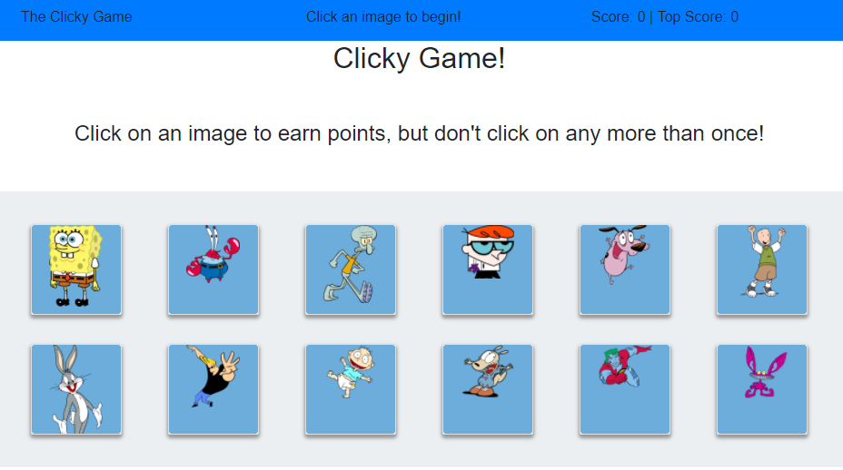
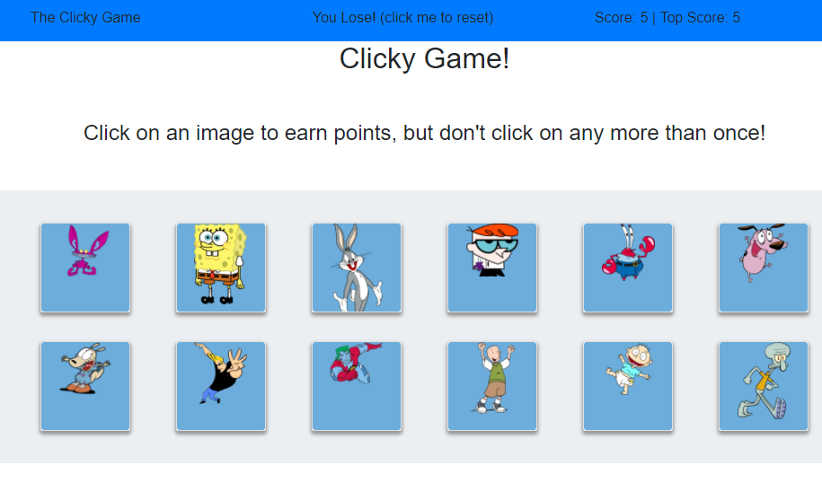

# Clicky-Game / ClickyTime!
React based memory game

### Overview

This app lets you click on cards until you click the same card twice.  It uses React to handle the UI items.  data is stored as state.  I have hosted it on Heroku.

-----------------------------------------
#### March 2018 

-----------------------------------------

Current Version 1.0

---

* Click the images one at a time.

* The images shuffle after each click.

* High score and current score are stored as state data and displayed live.

* Click the same image more than once, and you lose!

* [Check out this web site to see it in action!](https://clickytime.herokuapp.com/.

---

## Screenshots

<table>
    <tr>
        <td>
            
        </td>
        <td>
            
        </td>
    </tr>
</table>

## How you can help

* Please let us know if you find any errors or if you have ways to achieve better efficiency.

-----------------------------------------

### How does the app work?

1. The app uses the react for the UI.

2. The data is stored as component state data.

3. The app is hosted on heroku.

## Dependencies
    
    "react": "^16.2.0",
    "react-dom": "^16.2.0",
    "react-scripts": "1.1.1"

## History

This project was created as a homework assignment on 03-20-18 for the University of Richmond Programming Bootcamp.

## License

This project is in the public domain within the United States, and
copyright and related rights in the work worldwide are waived through
the [CC0 1.0 Universal public domain dedication](https://creativecommons.org/publicdomain/zero/1.0/).# group2-project2